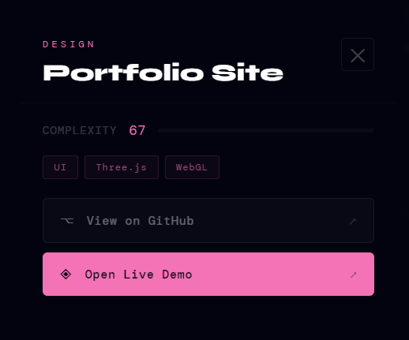
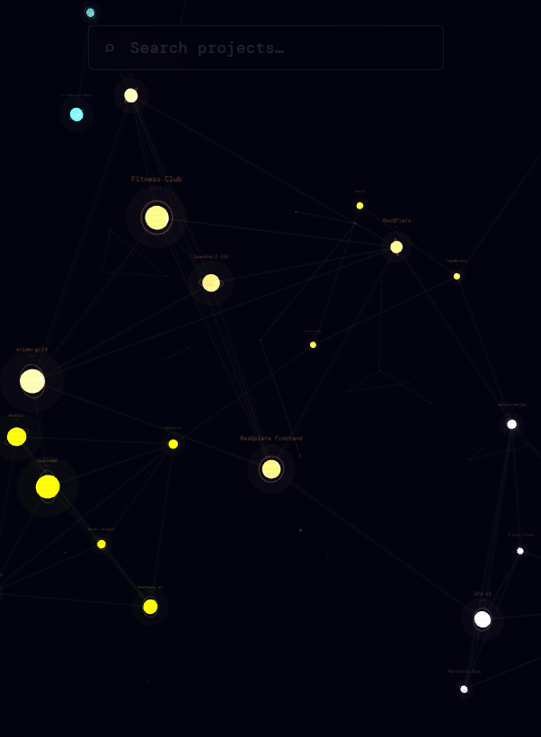
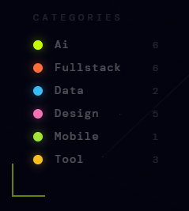
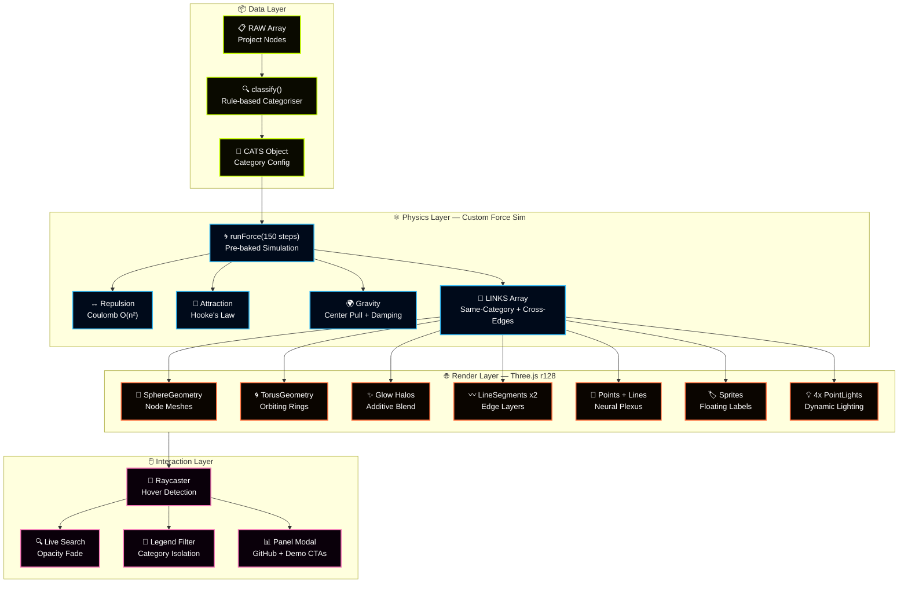
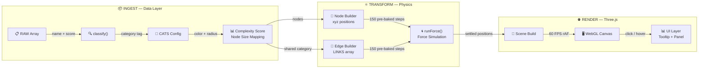
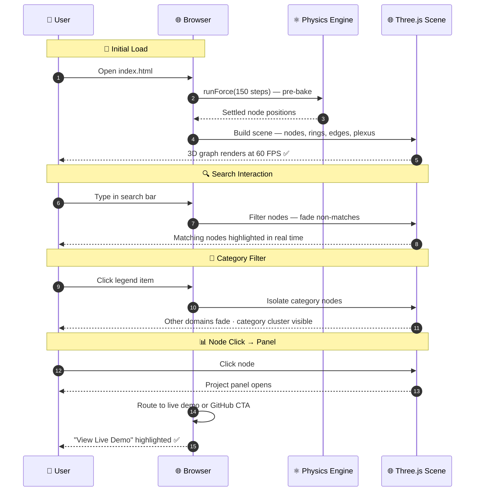

<div align="center">

<!-- ══════════════════════════════════════════════════════════════════ -->
<!--                        HERO BANNER                               -->
<!-- ══════════════════════════════════════════════════════════════════ -->


<picture>
  
</picture>

<br/>

<!-- ── Hero Demo ── -->
<a href="https://salonyranjan.github.io/neural-map/" target="_blank">
  
</a>

<br/><br/>


<br/><br/>

<!-- ── Badges Row 1 — Status ── -->
[](https://salonyranjan.github.io/neural-map/)
[](https://github.com/salonyranjan/neural-map/releases)
[](LICENSE)
[](https://github.com/salonyranjan/neural-portfolio/stargazers)

<br/>

<!-- ── Badges Row 2 — Tech ── -->


<br/>

<!-- ── Badges Row 3 — Stats ── -->


<br/>


<br/><br/>

> *"Not a résumé. Not a portfolio page. A living, breathing 3D knowledge graph that lets you explore the relationships between skills, projects, and complexity — in real time."*

<br/>

<a href="https://salonyranjan.github.io/neural-map/"></a>
&nbsp;
<a href="#10--getting-started"></a>
&nbsp;
<a href="#5--architecture"></a>
&nbsp;
<a href="#9--roadmap"></a>

</div>

---

## 📋 Table of Contents

1. [🌐 What is Neural Map?](#1--what-is-neural-map)
2. [🖼️ Visual Showcase](#2-️-visual-showcase)
3. [📊 System at a Glance](#3--system-at-a-glance)
4. [✨ Key Features](#4--key-features)
5. [🏗️ Architecture](#5-️-architecture)
   - 5.1 [🔷 System Architecture Diagram](#51--system-architecture-diagram)
   - 5.2 [🔄 Data Flow — RAW → Graph](#52--data-flow--raw--graph)
   - 5.3 [⚡ Render Pipeline Sequence](#53--render-pipeline-sequence)
6. [🛠️ Tech Stack](#6-️-tech-stack)
7. [🤔 Why I Built This](#7--why-i-built-this)
8. [📂 Project Structure](#8--project-structure)
9. [🗺️ Roadmap](#9-️-roadmap)
10. [📦 Getting Started](#10--getting-started)
11. [🚀 Deployment](#11--deployment)
12. [⚡ Performance](#12--performance)
13. [🎨 Color System](#13--color-system)
14. [🎮 Controls](#14--controls)
15. [🔧 Customization](#15--customization)
16. [❓ FAQ](#16--faq)
17. [👤 Author](#17--author)
18. [⭐ Show Your Support](#18--show-your-support)

---

## 1. 🌐 What is Neural Map?

**Neural Map** is a 3D interactive knowledge graph that visualises 23 engineering projects across 6 domains — in real time, in your browser, with zero npm packages. Instead of a static résumé or a flat portfolio page, it renders a **force-directed 3D network** where nodes represent projects, edges represent shared categories, and node size reflects project complexity.

> 🎯 **The core insight:** Recruiters don't just need to see *what* you've built — they need to understand the *relationships* between your skills. A graph makes that viscerally obvious in seconds — no scrolling required.

| 🔖 | Version | 📦 Highlight |
|:---:|:---:|:---|
| 🆕 | `v1.0` | 3D force-directed graph · 23 nodes · 17 live demos · live search · category filter · zero dependencies |

---

## 2. 🖼️ Visual Showcase

Neural Map is a cinematic, spatial experience — built to communicate engineering depth at a glance.

---

### 🌐 The Knowledge Graph — *Full 3D View*

<div align="center">
  
  
  
  
  
  <p><i>Live force-directed graph — orbit, pan, and zoom through 23 nodes with custom physics.</i></p>
</div>

> 🌐 **Complexity-weighted node scaling** — larger nodes = higher project complexity · **Distance-based edge fading** eliminates visual clutter · **60 FPS** `requestAnimationFrame` loop keeps physics smooth at any depth

---

### 🔍 Live Search — *Real-Time Node Filter*

<div align="center">
  
  <p><i>Type to filter — non-matching nodes fade out in real time, leaving only what you're looking for.</i></p>
</div>

> ⚡ Filters nodes by name instantly · Non-matching nodes fade to near-invisible · Camera stays in place — no jarring transitions

---

### 📊 Project Panel — *Click-to-Drill-Down*

<div align="center">
  
  <p><i>Click any node to open its panel — tech stack, complexity score, GitHub + live demo CTAs.</i></p>
</div>

> 🔗 **Smart link routing** — live demo link promoted above GitHub source · Tech tag chips · Complexity score badge · Press Esc to close

---

## 3. 📊 System at a Glance

| 🔢 Metric | 🎯 Value | 📝 Notes |
|:---|:---:|:---|
| 🎯 **Render FPS** | `60 FPS` | `requestAnimationFrame` physics + Three.js GPU compositing |
| 🔗 **Nodes** | `23` | All projects with complexity scores |
| 🎬 **Live Demos** | `17` | Vercel + Streamlit deployments |
| 🌐 **Domains** | `6` | AI/ML · Fullstack · Data · Design · Tool · Utility |
| 🔍 **Search** | Real-time | Fades non-matching nodes on every keystroke |
| 🏗️ **Build** | None | Single HTML file — open and it works |
| ☁️ **Bundle** | `~260KB` | Three.js r128 via CDN — zero else |
| 📦 **npm packages** | `0` | Zero dependencies, zero build step |

---

## 4. ✨ Key Features

<table>
  <tr><td>🌐</td><td><strong>Interactive 3D Graph</strong></td><td>Force-directed node physics with orbit, pan, and zoom — custom <code>requestAnimationFrame</code> loop delivers 60 FPS at any graph size</td></tr>
  <tr><td>⚛️</td><td><strong>Custom Physics Engine</strong></td><td>Hand-written Coulomb repulsion + Hooke's law attraction + gravity — zero D3, zero physics library. Pre-baked 150 steps before first render so the graph appears already-settled on load</td></tr>
  <tr><td>📊</td><td><strong>Complexity-Weighted Nodes</strong></td><td>Node size scales with project complexity score (lines of code × tech diversity × stars) — visual hierarchy emerges naturally without manual curation</td></tr>
  <tr><td>🔍</td><td><strong>Live Search</strong></td><td>Type any project name — non-matching nodes fade out in real time, letting you isolate any project in the graph instantly</td></tr>
  <tr><td>🎨</td><td><strong>Category Filter</strong></td><td>Click any legend item to isolate an entire domain — AI/ML, Fullstack, Data, Design, Tool, or Utility — with one tap</td></tr>
  <tr><td>💡</td><td><strong>Hover Tooltip</strong></td><td>Hover any node for an instant overlay — name, complexity score, tech tags, and quick links to GitHub and live demo</td></tr>
  <tr><td>📋</td><td><strong>Project Panel</strong></td><td>Click any node to open a full-detail panel — live demo CTA, GitHub source link, tags, and score. Press Esc to close</td></tr>
  <tr><td>🌀</td><td><strong>Orbiting Torus Rings</strong></td><td>Each node has a category-coloured orbiting ring that spins continuously — a subtle signal of the graph being alive</td></tr>
  <tr><td>🌌</td><td><strong>Neural Plexus Background</strong></td><td>140 ambient particles form a dynamic proximity-linked plexus in the background — creating depth and atmosphere without performance cost</td></tr>
  <tr><td>⚡</td><td><strong>Zero Build Step</strong></td><td>Single HTML file. No <code>npm install</code>. No config. Open in any browser and it works</td></tr>
</table>

---

## 5. 🏗️ Architecture

### 5.1 🔷 System Architecture Diagram



### 5.2 🔄 Data Flow — RAW → Graph



### 5.3 ⚡ Render Pipeline Sequence



---

## 6. 🛠️ Tech Stack

<p>
  
  
  
  
  
  
</p>

| ⚙️ Technology | 🔬 Usage | 🏆 Result |
|:---|:---|:---|
| **Three.js r128** | 3D scene, materials, lighting, sprites | Real-time 60 FPS GPU-composited scene |
| **Custom rAF Loop** | Physics simulation at 60 FPS | Buttery smooth node movement at any graph size |
| **Coulomb Repulsion** | O(n²) node spreading | No overlapping nodes — ever |
| **Hooke's Attraction** | Same-category spring pull | Domain clusters emerge from physics, not layout code |
| **Canvas Texture Sprites** | Floating project labels | Zero font-render overhead — labels as GPU textures |
| **FogExp2** | Exponential depth fog | Natural depth cue, free GPU hint |
| **Additive Blending** | Glow halos on nodes | Neon depth without shader complexity |

**Why vanilla JS + single file?**

| Constraint | Reason |
|:---|:---|
| No npm | Anyone can clone and double-click to run — zero friction |
| No framework | Three.js + raw DOM is faster for pure 3D — no virtual DOM overhead |
| No bundler | Zero config, zero maintenance, zero build time |
| CDN Three.js | ~260KB vs a React+Three.js bundle at 400KB+ |
| Single HTML | Deploys anywhere: GitHub Pages, Vercel, S3, Netlify |

---

## 7. 🤔 Why I Built This

Static résumés are linear. They list projects sequentially but hide the most important signal: **how skills and projects relate to each other**.

A recruiter looking at a flat list can't see that my RAG pipelines, vector databases, and LLM tooling form a coherent specialisation — or that my 3D web work shares a rendering philosophy with my data visualisation work.

**Neural Map makes those connections tangible in 3 seconds.**

**The three engineering problems I solved to get there:**

| 🔧 Problem | 💡 Solution |
|:---|:---|
| **Graph layout** — manual positioning doesn't scale | Custom 3D force simulation — physics determines layout, not me |
| **Visual overload** — 23 nodes + 40 edges = spaghetti | Distance-based edge fading + complexity-weighted node scaling creates natural hierarchy |
| **60 FPS with physics** — simulation is expensive | Pre-bake 150 steps before render — graph appears settled instantly, no cost at runtime |

---

## 8. 📂 Project Structure

```
🌐 neural-map/
│
├── 🌐 index.html                       # ← Everything. Single file. Zero build.
│
├── 📂 assets/                          # Media & Documentation
│   ├── 🎬 demo.gif                     # Project showcase loop
│   └── 🎨 1.png, 2.png, ...            # UI screenshots
│
├── 📄 .gitignore                       # Git ignore rules
└── 📄 README.md                        # This file
```

**Inside `index.html` — logical layers:**

```
index.html
│
├── DATA LAYER          RAW[], CATS{}, classify()
├── PHYSICS LAYER       runForce(), LINKS[]
├── RENDER LAYER        Three.js scene construction
└── INTERACTION LAYER   Raycaster, search, legend, panel
```

---

## 9. 🗺️ Roadmap

| Status | 🚀 Feature | 🎯 Priority |
|:---:|:---|:---:|
| ✅ | 3D force-directed knowledge graph | 🔴 Core |
| ✅ | 23 project nodes with complexity scoring | 🔴 Core |
| ✅ | 6-category color system + legend filter | 🔴 Core |
| ✅ | Live search with real-time node fade | 🔴 Core |
| ✅ | Hover tooltip + click project panel | 🔴 Core |
| ✅ | 17 live demo links — Vercel + Streamlit | 🔴 Core |
| ✅ | Orbiting torus rings + glow halos | 🔴 Core |
| ✅ | 140-particle neural plexus background | 🔴 Core |
| ✅ | FPS counter · live clock · loading screen | 🔴 Core |
| ✅ | Zero build step — single HTML file | 🔴 Core |
| 🔄 | **Touch / Pinch-to-Zoom** — mobile orbit + pinch gestures | 🟡 High |
| 🔄 | **LLM Hover Summaries** — GPT/Groq auto-generates descriptions on hover | 🟡 High |
| 🔄 | **GitHub Live Sync** — auto-pull latest repo metadata via GitHub API | 🟡 High |
| 📅 | **Recruiter Share Link** — generate a filtered, shareable graph URL | 🟢 Planned |
| 📅 | **Timeline Mode** — chronological commit activity view | 🟢 Planned |
| 📅 | **Skill Clustering** — auto-group by detected technology domain | 🟢 Planned |
| 💡 | **AR Mode** — WebXR immersive graph on Vision Pro / Quest | 🔵 Idea |
| 💡 | **Voice Navigation** — "show me AI projects" via Web Speech API | 🔵 Idea |

> 💬 [Open a feature request →](https://github.com/salonyranjan/neural-portfolio/issues/new)

---

## 10. 📦 Getting Started

Get Neural Map running locally in under **60 seconds**.

### 10.1 🔧 Prerequisites

| 🛠️ Tool | 📌 Version | 🔗 Link |
|:---|:---:|:---|
|  | Chrome / Firefox / Safari / Edge | — |
|  | any | [git-scm.com](https://git-scm.com/) |

> ✅ No Node.js. No Python. No package manager. No config files.

### 10.2 ⬇️ Clone & Run

**📥 Option 1 — Just open it (no server needed)**

```bash
git clone https://github.com/salonyranjan/neural-map.git
cd neural-map
open index.html
```

**🖥️ Option 2 — Serve with Node**

```bash
npx serve .
# → http://localhost:3000
```

**🐍 Option 3 — Serve with Python**

```bash
python -m http.server 8080
# → http://localhost:8080
```

### 10.3 🖥️ That's It

| 📜 Action | 💻 Command | 📝 Result |
|:---|:---|:---|
| 🌐 Open locally | `open index.html` | Graph launches in browser |
| ⚡ Serve locally | `npx serve .` | Dev server at `:3000` |
| 🚀 Deploy | Push to GitHub Pages | Live in 30 seconds |

> **No `npm install`. No `npm run build`. No `.env` files.**

---

## 11. 🚀 Deployment

### ☁️ GitHub Pages (Recommended — Free)

```
1. Push index.html to your GitHub repo
2. Go to Settings → Pages
3. Set source: main branch / root
4. Done ✅ — live at https://username.github.io/neural-map/
```

### ▲ Vercel

```bash
vercel deploy
# → live in ~30 seconds
```

### 🌐 Any Static Host

Neural Map is a single HTML file. It deploys anywhere that serves static files — S3, Netlify, Cloudflare Pages, Render, Firebase Hosting.

---

## 12. ⚡ Performance

| 📊 Metric | 🎯 Value | 📝 Implementation |
|:---|:---:|:---|
| 🎯 **Render FPS** | `60 FPS` | Native `requestAnimationFrame` — never blocked by React |
| 🌀 **Physics Pre-bake** | `150 steps` | Computed before first frame — zero runtime cost |
| 🌌 **Particles** | `140` | Reduce `PCOUNT` constant for mobile/older GPUs |
| 📐 **Pixel Ratio Cap** | `min(dPR, 2)` | Prevents 4K overdraw on HiDPI screens |
| 🌫️ **Fog** | `FogExp2 · 0.0028` | Natural depth cue — free GPU performance hint |
| 📦 **Bundle** | `~260KB` | Three.js r128 via CDN — zero else loaded |

**Bottlenecks by priority:**

```
1.  O(n²) repulsion   →  fine at n=23 · use Barnes-Hut tree for n > 100
2.  Background plexus →  reduce PCOUNT=80 or disable on mobile
3.  Glow halos        →  additive blending is GPU-cheap · safe to keep
4.  Canvas sprites    →  regenerated on demand only · no per-frame cost
```

---

## 13. 🎨 Color System

Every pixel in Neural Map traces back to one of eight constants — zero ad-hoc colors.

| Swatch | Hex | Domain | Usage |
|:---:|:---|:---|:---|
| 🟡 | `#c8ff00` | AI / ML | Node · ring · glow · edge · tooltip · label |
| 🟠 | `#ff6e3c` | Fullstack | Node · ring · glow · edge · tooltip · label |
| 🔵 | `#38bdf8` | Data | Node · ring · glow · edge · tooltip · label |
| 🩷 | `#f472b6` | Design | Node · ring · glow · edge · tooltip · label |
| 🟢 | `#a3e635` | Tool | Node · ring · glow · edge · tooltip · label |
| 🟡 | `#fbbf24` | Utility | Node · ring · glow · edge · tooltip · label |
| ⬛ | `#03030f` | Background | Canvas · void · near-black |
| ⬜ | `#ffffff` | Text | Labels · UI · headings |

---

## 14. 🎮 Controls

| 🖱️ Input | 🎯 Action |
|:---|:---|
| **Left drag** | Rotate (orbital camera) |
| **Right drag** | Pan (translate view) |
| **Scroll wheel** | Zoom in / out (35–380 clamp) |
| **Hover node** | Show tooltip + quick links |
| **Click node** | Open project panel |
| **Search bar** | Filter nodes by name (real-time) |
| **Legend item** | Isolate category (toggle) |
| **Esc** | Close open panel |

---

## 15. 🔧 Customization

### Add a project

Append to the `RAW` array inside `<script>`:

```js
{
  name: "MyProject",
  score: 150000,          // complexity score — controls node size
  gh:   "https://github.com/salonyranjan/MyProject",
  demo: "https://my-project.vercel.app/"   // null if no live demo
}
```

### Change category rules

Edit the `classify()` function:

```js
function classify(name, score) {
  if (name.includes('myterm')) return 'ai';
  if (score > 200000)         return 'fullstack';
  // add your own rules...
}
```

### Tune physics constants

```js
const f = 900 / d2;          // repulsion strength  (↑ = more spread)
const f = (d - 28) * 0.018;  // spring rest-length & stiffness
n.vx *= 0.78;                 // damping  (↓ = bouncier, slower settle)
```

### Reduce particles for mobile

```js
const PCOUNT = 80;   // default 140 — lower for older GPUs
```

---

## 16. ❓ FAQ

<details>
<summary><strong>⚡ Why is the graph already settled when it loads?</strong></summary>

The physics simulation runs 150 steps before the first render frame — called "pre-baking". This means the graph appears fully laid out the moment the canvas draws. Without pre-baking, nodes would explode outward from the origin on load and slowly settle, which looks chaotic. Pre-baking is free because it runs synchronously before `requestAnimationFrame` starts.
</details>

<details>
<summary><strong>🌐 Why vanilla JS instead of React + R3F?</strong></summary>

For a pure 3D interaction project, vanilla JS + Three.js is faster, smaller, and simpler. React's virtual DOM adds overhead with no benefit when the primary output is a WebGL canvas. The entire project ships as a single 260KB HTML file — vs a React+Three.js bundle at 400KB+ before your own code.
</details>

<details>
<summary><strong>🔷 How does the force simulation work?</strong></summary>

Three forces act on every node each tick: Coulomb-style repulsion (`900 / d²`) pushes all nodes apart, Hooke's law attraction (`(d - 28) × 0.018`) pulls same-category nodes together along edges, and a gravity term (`-0.012 × position`) keeps the graph centered. Velocity is damped by `0.78×` each tick so the system loses energy and settles. All 150 pre-bake ticks run in a synchronous loop before the first `requestAnimationFrame`.
</details>

<details>
<summary><strong>📱 Does it work on mobile?</strong></summary>

The graph renders on mobile browsers — touch-to-rotate and scroll-to-zoom work. Full pinch-to-zoom and dedicated swipe-to-orbit are on the roadmap. For low-end mobile GPUs, reduce `PCOUNT` from 140 to 60–80 for smoother performance.
</details>

---

## 17. 👤 Author

<table style="border:none;">
  <tr>
    <td align="center" style="border:none;" width="160">
      
    </td>
    <td style="border:none; padding-left:22px;">
      <h3>✦ Salony Ranjan</h3>
      <p>🌐 3D Web Engineer &nbsp;·&nbsp; 🤖 AI/ML Developer &nbsp;·&nbsp; 🚀 Full-Stack Builder</p>
      <p>B.Tech CSE 2026 &nbsp;·&nbsp; Netaji Subhas Engineering College, Kolkata</p>
      <p><em>"A résumé tells you what I've built. A knowledge graph shows you how it all connects."</em></p>
      <br/>
      <a href="https://www.linkedin.com/in/salony-ranjan-b63200280/"></a>
      &nbsp;
      <a href="https://github.com/salonyranjan"></a>
      &nbsp;
      <a href="mailto:salonyranjan@gmail.com"></a>
      &nbsp;
      <a href="https://salonyranjan.github.io/neural-map/"></a>
    </td>
  </tr>
</table>

---

## 18. ⭐ Show Your Support
If Neural Map changed how you think about developer portfolios, taught you something about 3D graph rendering, or just looked incredible — show it some love! 🌐

> 💡 **Pro Tip:** Go to your GitHub repo **Settings → Social Preview** and upload the `demo.gif` first frame as a static PNG. When you share on LinkedIn, the 3D graph renders as the preview card — and immediately signals this is not a standard portfolio.

<a href="https://github.com/salonyranjan/neural-portfolio/stargazers"></a>
&nbsp;
<a href="https://github.com/salonyranjan/neural-portfolio/fork"></a>
&nbsp;
<a href="https://salonyranjan.github.io/neural-map/"></a>
&nbsp;
<a href="https://github.com/salonyranjan/neural-portfolio/issues/new"></a>

<br/><br/>


<br/>

*Built with* 🌐 *by* [**Salony Ranjan**](https://github.com/salonyranjan) &nbsp;·&nbsp; *© 2026 Neural Map · MIT*


</div>
