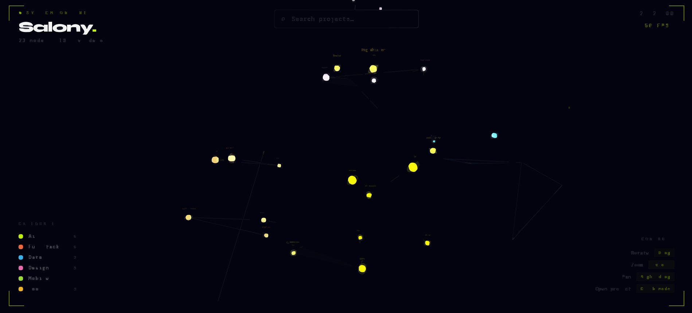
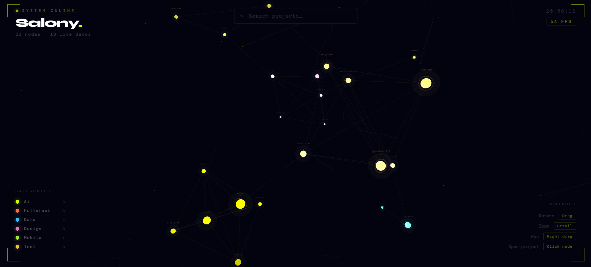
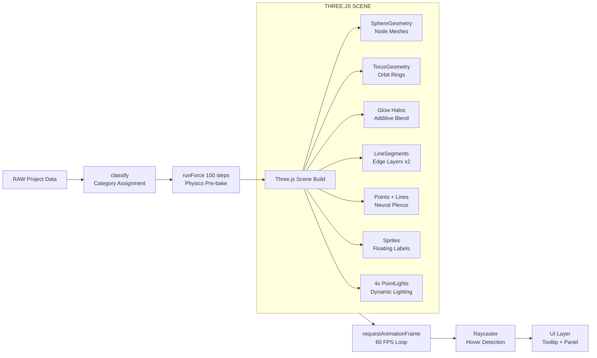

<div align="center">

<!-- HERO BANNER -->
<picture>
  
</picture>

<br/>
<br/>

```
███╗   ██╗███████╗██╗   ██╗██████╗  █████╗ ██╗       ███╗   ███╗ █████╗ ██████╗
████╗  ██║██╔════╝██║   ██║██╔══██╗██╔══██╗██║       ████╗ ████║██╔══██╗██╔══██╗
██╔██╗ ██║█████╗  ██║   ██║██████╔╝███████║██║       ██╔████╔██║███████║██████╔╝
██║╚██╗██║██╔══╝  ██║   ██║██╔══██╗██╔══██║██║       ██║╚██╔╝██║██╔══██║██╔═══╝
██║ ╚████║███████╗╚██████╔╝██║  ██║██║  ██║███████╗  ██║ ╚═╝ ██║██║  ██║██║
╚═╝  ╚═══╝╚══════╝ ╚═════╝ ╚═╝  ╚═╝╚═╝  ╚═╝╚══════╝  ╚═╝     ╚═╝╚═╝  ╚═╝╚═╝
```

<br/>

<!-- TAGLINE -->
### *A living, breathing 3D knowledge graph — not a portfolio page.*
#### *23 projects · 17 live demos · 6 domains · 60 FPS · zero dependencies*

<br/>

<!-- BADGES ROW 1 -->
[](https://salonyranjan.github.io/neural-map/)
[](https://github.com/salonyranjan)
[](https://vertex-flow-phi.vercel.app/)
[](https://www.linkedin.com/in/salony-ranjan-b63200280/)

<br/>

<!-- BADGES ROW 2 -->
[](https://github.com/salonyranjan)
[](https://salonyranjan.github.io/neural-map/)
[](https://salonyranjan.github.io/neural-map/)
[](https://salonyranjan.github.io/neural-map/)
[](https://github.com/salonyranjan/neural-portfolio/stargazers)

<br/>

---

<!-- HERO STATUS BLOCK -->
```
╔══════════════════════════════════════════════════════════════════════╗
║  ◉ NEURAL MAP  —  SYSTEM ONLINE                                      ║
║  ░░░░░░░░░░░░░░░░░░░░░░░░░░░░░░░░░░░░░░░░░░░░░░░░░░░░░░░░  100%   ║
║                                                                       ║
║  nodes  ···  23        edges  ···  ~40        fps  ·····  60         ║
║  demos  ···  17        domains ··  6          size  ····  ~260 KB    ║
║  build  ···  none      deps  ···   0          file  ····  1 HTML     ║
╚══════════════════════════════════════════════════════════════════════╝
```

<br/>

<!-- DEMO GIF -->


<br/>
<sub><i>Live force-directed graph · orbit, pan, zoom · 23 nodes · 6 categories · real-time physics</i></sub>

</div>

<br/>

---

## 📋 Table of Contents

| # | Section |
|:-:|:--------|
| 01 | [◈ What Is This?](#01--what-is-this) |
| 02 | [◈ The Idea](#02--the-idea) |
| 03 | [◈ Project Universe](#03--project-universe) |
| 04 | [◈ Live Projects](#04--live-projects) |
| 05 | [◈ Architecture](#05--architecture) |
| 06 | [◈ Physics Simulation](#06--physics-simulation) |
| 07 | [◈ Render Pipeline](#07--render-pipeline) |
| 08 | [◈ Tech Stack](#08--tech-stack) |
| 09 | [◈ Feature Checklist](#09--feature-checklist) |
| 10 | [◈ Color System](#10--color-system) |
| 11 | [◈ Controls](#11--controls) |
| 12 | [◈ Quick Start](#12--quick-start) |
| 13 | [◈ Customization](#13--customization) |
| 14 | [◈ Performance](#14--performance) |
| 15 | [◈ Author](#15--author) |

---

## 01. ◈ What Is This?

> **Neural Map** is not a portfolio. It's a knowledge graph where every node is a project, every edge is a relationship, and the layout is computed by physics.

Built entirely in a **single HTML file** with vanilla Three.js — no npm, no bundler, no framework. Open it in a browser. It works.

```
  ╔═════════════════════════════╗    ╔══════════════════════════════════╗
  ║   TRADITIONAL PORTFOLIO     ║    ║        NEURAL MAP                ║
  ╠═════════════════════════════╣    ╠══════════════════════════════════╣
  ║  [ Project Card 1         ] ║    ║         ◉ ─────── ◉             ║
  ║  [ Project Card 2         ] ║    ║        / \         \            ║
  ║  [ Project Card 3         ] ║    ║       ◉   ◉ ─────── ◉          ║
  ║  [ Project Card 4         ] ║    ║            \       /            ║
  ║  [ Project Card 5         ] ║    ║             ◉ ─── ◉            ║
  ╠═════════════════════════════╣    ╠══════════════════════════════════╣
  ║  Linear. Static. Forgotten. ║    ║  Spatial. Live. Memorable.       ║
  ╚═════════════════════════════╝    ╚══════════════════════════════════╝
```

Every interaction is intentional:

- **Hover** — reveals project metadata and direct links in a tooltip
- **Click** — opens a panel with GitHub + live demo buttons
- **Search** — fades out non-matching nodes in real time
- **Legend click** — isolates domains, revealing cluster structure

---

## 02. ◈ The Idea

<div align="center">

```
  ┌─────────────────────────────────────────────────────────────────┐
  │                                                                   │
  │   "The relationships between projects communicate more than       │
  │    the projects themselves. A graph makes that viscerally         │
  │    obvious in seconds — no scrolling required."                   │
  │                                                                   │
  └─────────────────────────────────────────────────────────────────┘
```

</div>

The graph's **layout is never manually set**. Nodes repel each other like charged particles, edges pull same-category projects together via spring forces, and the whole system settles into a topology that mirrors the actual structure of the work.

> Pre-baking 150 physics steps before the first frame means the graph appears already-settled on load — no jarring explosion of nodes.

---

## 03. ◈ Project Universe

<div align="center">

| Category | Color | Projects | Live Demos |
|:---------|:------|:--------:|:----------:|
| 🟡 **AI / ML** | `#c8ff00` acid lime | ZenithRAG · MediQuery.ai · RxScan-AI · SkillBridge-AI | 3 / 4 |
| 🟠 **Fullstack** | `#ff6e3c` burnt orange | Mocktail · OpenShelf-E2E · ResQPlate · BitFlow · CineNative · sonic-prep | 5 / 6 |
| 🔵 **Data** | `#38bdf8` sky blue | ct-patient-data · Retail Insights · RoleRadar | 2 / 3 |
| 🩷 **Design** | `#f472b6` hot pink | VertexFlow · GTA-VI · Z-Axis-Cloud · Portfolio | 4 / 4 |
| 🟢 **Tool** | `#a3e635` yellow-green | PageWhisper · Rewind · Fitness Club | 3 / 3 |
| 🟡 **Utility** | `#fbbf24` amber | anime-grid · ResQplate Frontend · salonyranjan | 1 / 3 |

</div>

```
  Total: 23 nodes · 17 live demos · 6 domains
  Node size ∝ complexity score (lines of code × tech diversity × stars)
  Edges  =  same-category attraction + random cross-category bridges
```

---

## 04. ◈ Live Projects

<table>
<tr>
<td width="50%" valign="top">

### 🤖 AI / Intelligence

| Project | Stack | Demo |
|:--------|:------|:----:|
| **ZenithRAG** | Python · LangChain · VectorDB | — |
| **MediQuery.ai** | Streamlit · OpenAI · FAISS | [↗](https://mediquery-ai.streamlit.app/) |
| **RxScan-AI** | React · OCR · Vision AI | [↗](https://rx-scan-ai.vercel.app/) |
| **SkillBridge-AI** | Next.js · GPT-4 | [↗](https://skill-bridge-ai-orpin.vercel.app/) |

### 📊 Data / Analytics

| Project | Stack | Demo |
|:--------|:------|:----:|
| **CT Patient Dashboard** | React · D3.js | [↗](https://ct-patient-data-dashboard.vercel.app/) |
| **Retail Insights** | SQL · Python · Power BI | — |
| **RoleRadar** | Streamlit · NLP | [↗](https://roleradarz.streamlit.app/) |

### 🛠️ Tools

| Project | Stack | Demo |
|:--------|:------|:----:|
| **PageWhisper** | Next.js · ElevenLabs · RAG | [↗](https://page-whisper.vercel.app/) |
| **Rewind** | MERN · Redux · JWT | [↗](https://rewind-pied.vercel.app/) |
| **Fitness Club** | React · Animation | [↗](https://fitness-club.vercel.app/) |

</td>
<td width="50%" valign="top">

### ⚡ Fullstack / Apps

| Project | Stack | Demo |
|:--------|:------|:----:|
| **Mocktail** | React · GSAP · Vite | [↗](https://mocktail-seven.vercel.app/) |
| **OpenShelf-E2E** | Streamlit · ML | [↗](https://openshelf-e2e.streamlit.app/) |
| **BitFlow** | React · Crypto API | [↗](https://bit-flow-two.vercel.app/) |
| **sonic-prep** | Next.js · Audio | [↗](https://sonic-prep.vercel.app/) |
| **ResQPlate** | React · Maps · AI | [↗](https://res-q-plate.vercel.app/) |

### 🎨 Design / Visual

| Project | Stack | Demo |
|:--------|:------|:----:|
| **VertexFlow** | Three.js · WebGL · R3F | [↗](https://vertex-flow-phi.vercel.app/) |
| **GTA-VI** | React · GSAP · Scroll | [↗](https://gta-vi-woad.vercel.app/) |
| **Z-Axis-Cloud** | CSS · JS · 3D | [↗](https://z-axis-cloud.vercel.app/) |
| **anime-grid** | React · CSS Grid | [↗](https://anime-grid-nine.vercel.app/) |

</td>
</tr>
</table>

---

## 05. ◈ Architecture

```
neural-map/
│
├── index.html                      ← single file · zero build step
│
├── ── DATA LAYER ──────────────────────────────────────────────────────
│   ├── RAW[]                       project nodes (name, score, gh, demo)
│   ├── CATS{}                      category config (color, radius, tags)
│   └── classify()                  rule-based category assignment
│
├── ── PHYSICS LAYER ───────────────────────────────────────────────────
│   ├── runForce(steps)             custom 3D force simulation
│   │   ├── repulsion               O(n²) Coulomb-style node repulsion
│   │   ├── attraction              Hooke's law on category edges
│   │   └── gravity                 center pull + velocity damping
│   └── LINKS[]                     same-category + random cross-edges
│
├── ── RENDER LAYER (Three.js r128) ────────────────────────────────────
│   ├── SphereGeometry              core node mesh (MeshStandardMaterial)
│   ├── TorusGeometry               orbiting ring per node
│   ├── SphereGeometry              outer additive glow halo
│   ├── LineSegments (×2)           edge layers (lime + blue channels)
│   ├── Points + LineSegments       background neural plexus animation
│   ├── Sprite (Canvas texture)     floating labels with complexity score
│   └── 4× PointLight               animated dynamic coloured lighting
│
└── ── INTERACTION LAYER ───────────────────────────────────────────────
    ├── mousemove → raycaster       hover detection (hitMeshes array)
    ├── pointerdown / pointerup     orbital drag vs click disambiguation
    ├── wheel                       zoom (radius clamped 35–380)
    ├── input[search]               live node filter + opacity fade
    ├── legend click                category isolation mode
    └── panel modal                 GitHub + live demo CTA buttons
```

**Data flow in one line:**

```
RAW[] → classify() → CATS{} → runForce(150) → Three.js scene → 60 FPS canvas
```

---

## 06. ◈ Physics Simulation

The layout is computed by a **custom 3D force-directed algorithm** — no D3, no physics library.

```
  Each simulation tick (pre-baked · 150 iterations before first render):

  REPULSION    Fᵢⱼ  =  900 / |rᵢ − rⱼ|²         nodes push apart
  ATTRACTION   Fᵢⱼ  =  (d − 28) × 0.018          linked nodes pull together
  GRAVITY      F    =  −0.012 × position          global centering force
  DAMPING      v    =  v × 0.78                   energy dissipation
```

| Force | Effect | Visual Result |
|:------|:-------|:-------------|
| Repulsion | Nodes spread out | No overlapping nodes |
| Attraction | Same-category nodes cluster | Domain groups emerge naturally |
| Cross-edges | Random inter-category links | Bridge connections reveal skill overlap |
| Complexity score | Controls `SphereGeometry` radius | Heavier projects visually dominant |
| Gravity | Keeps graph centered | Graph stays in view without clamping |

---

## 07. ◈ Render Pipeline



---

## 08. ◈ Tech Stack

```
  ╔═══════════════════════════════════════════════════════════════╗
  ║  Runtime        Vanilla JS (ES2020+)                          ║
  ║  3D Engine      Three.js r128                                 ║
  ║  Fonts          Syne 800 · DM Mono 300 / 400 / 500           ║
  ║  Physics        Custom force simulation (zero D3)             ║
  ║  Build          None — single HTML file                       ║
  ║  Deploy         GitHub Pages · Vercel · any static host       ║
  ║  Bundle size    ~260KB (Three.js via CDN)                     ║
  ║  npm packages   0                                             ║
  ║  Dependencies   0                                             ║
  ╚═══════════════════════════════════════════════════════════════╝
```

**Why vanilla JS + single file?**

| Constraint | Reason |
|:-----------|:-------|
| No npm | Eliminates build complexity — anyone can clone and open |
| No framework | Three.js + raw DOM is faster for pure 3D interaction |
| No bundler | Zero config, zero maintenance, zero build time |
| CDN Three.js | ~260KB vs a React+Three.js bundle at 400KB+ |
| Single HTML | Deploy anywhere: GitHub Pages, Vercel, S3, any static host |

---

## 09. ◈ Feature Checklist

```
  [✓]  Real-time 3D force-directed graph
  [✓]  23 project nodes with complexity scoring
  [✓]  6-category color system with legend filter
  [✓]  Live search — filters & fades nodes in real time
  [✓]  Hover tooltip — name, score, tags, quick links
  [✓]  Click panel — GitHub + live demo buttons
  [✓]  17 live demo links (Vercel / Streamlit)
  [✓]  Orbiting torus rings per node
  [✓]  Animated point lights (4 colors, continuous drift)
  [✓]  Background neural plexus (140 particles)
  [✓]  Auto-rotate with pause-on-interact
  [✓]  Right-click drag to pan
  [✓]  Scroll to zoom (clamped 35–380)
  [✓]  Sprite labels with score subtitles
  [✓]  Loading screen with fade-out
  [✓]  Scanline overlay + vignette post-process
  [✓]  FPS counter (color-coded: green → red)
  [✓]  Live clock
  [✓]  Escape key to close panel
  [✓]  Zero build step — single HTML file
  [ ]  Touch / pinch-to-zoom  (roadmap)
  [ ]  LLM hover summaries    (roadmap)
  [ ]  Recruiter share link   (roadmap)
```

---

## 10. ◈ Color System

```
  ╔══════════════════════════════════════════════════════════╗
  ║                                                          ║
  ║   ████  #c8ff00  ─  AI / ML           acid lime         ║
  ║   ████  #ff6e3c  ─  Fullstack         burnt orange      ║
  ║   ████  #38bdf8  ─  Data              sky blue          ║
  ║   ████  #f472b6  ─  Design            hot pink          ║
  ║   ████  #a3e635  ─  Tool              yellow-green      ║
  ║   ████  #fbbf24  ─  Utility           amber             ║
  ║   ──────────────────────────────────────────────────     ║
  ║   ████  #03030f  ─  background        near-black void   ║
  ║   ████  #ffffff  ─  text              white             ║
  ║                                                          ║
  ╚══════════════════════════════════════════════════════════╝
```

Each category color cascades through the **entire visual system**:

- Node emissive material · Orbiting torus ring · Outer additive glow halo
- Edge `LineSegments` (both layers) · Tooltip border accent · Panel border
- Legend dot · Label sprite background · Tag chips on hover

> Zero ad-hoc colors — every pixel traces back to its category constant.

---

## 11. ◈ Controls

```
  ╔══════════════════════╦══════════════════════════════════════╗
  ║  Left drag           ║  Rotate (orbital camera)             ║
  ║  Right drag          ║  Pan (translate view)                ║
  ║  Scroll wheel        ║  Zoom in / out  (35 – 380 clamp)     ║
  ║  Hover node          ║  Show tooltip + quick links          ║
  ║  Click node          ║  Open project panel                  ║
  ║  Search bar          ║  Filter nodes by name (real-time)    ║
  ║  Legend item         ║  Isolate category (toggle)           ║
  ║  Esc                 ║  Close open panel                    ║
  ╚══════════════════════╩══════════════════════════════════════╝
```

---

## 12. ◈ Quick Start

```bash
# Option 1 — just open it  (no server needed)
open index.html

# Option 2 — serve with Node
npx serve .
# → http://localhost:3000

# Option 3 — serve with Python
python -m http.server 8080
# → http://localhost:8080

# Option 4 — deploy to Vercel
vercel deploy
# → live in ~30 seconds

# Option 5 — deploy to GitHub Pages
# Push index.html to main branch
# Enable Pages under Settings → Pages
```

> **No `npm install`. No `npm run build`. No `.env` files. No config.**
> Open `index.html` in any browser and it works.

---

## 13. ◈ Customization

### Add a project

Append to the `RAW` array inside `<script>`:

```js
{
  name: "MyProject",
  score: 150000,           // complexity score — controls node size
  gh:   "https://github.com/salonyranjan/MyProject",
  demo: "https://my-project.vercel.app/"  // null if no live demo
}
```

### Change category rules

Edit the `classify()` function:

```js
function classify(name, score) {
  if (name.includes('myterm')) return 'ai';
  if (score > 200000)         return 'fullstack';
  // add your own rules...
}
```

### Tune physics constants

```js
const f = 900 / d2;          // repulsion strength  (↑ = more spread)
const f = (d - 28) * 0.018;  // spring rest-length & stiffness
n.vx *= 0.78;                 // damping  (↓ = bouncier, slower settle)
```

### Reduce particle count (mobile / lower-end GPUs)

```js
const PCOUNT = 80;   // default 140
```

---

## 14. ◈ Performance

| Metric | Value | Notes |
|:-------|:-----:|:------|
| Render target | `60 FPS` | `requestAnimationFrame` loop |
| Initial force steps | `150` | Pre-baked before first render |
| Background particles | `140` | Reduce `PCOUNT` for lower-end devices |
| Plexus connections | Dynamic | Distance-threshold proximity links |
| Pixel ratio cap | `min(devicePixelRatio, 2)` | Prevents 4K overdraw |
| Fog | `FogExp2 · 0.0028` | Natural depth cue, free GPU hint |
| Bundle | `~260KB` | Three.js r128 via CDN, zero else |

**Bottlenecks by priority:**

```
  1.  O(n²) repulsion   →  acceptable at n=23 · use Barnes-Hut for n>100
  2.  Background plexus →  reduce PCOUNT or disable for mobile
  3.  Glow halos        →  additive blending is cheap · safe to keep
  4.  Labels (Sprites)  →  Canvas texture per node · regenerate on demand only
```

---

## 15. ◈ Author

<div align="center">

```
  ╔══════════════════════════════════════════════════════════════╗
  ║                                                              ║
  ║   Salony Ranjan                                              ║
  ║   Full-stack developer & AI engineer                         ║
  ║                                                              ║
  ║   Building at the intersection of intelligent systems,       ║
  ║   real-time 3D, and product design.                          ║
  ║                                                              ║
  ║   GitHub     →   github.com/salonyranjan                     ║
  ║   Portfolio  →   vertex-flow-phi.vercel.app                  ║
  ║   Email      →   salonyranjan@gmail.com                      ║
  ║                                                              ║
  ╚══════════════════════════════════════════════════════════════╝
```

<br/>

[](https://github.com/salonyranjan)
&nbsp;
[](https://www.linkedin.com/in/salony-ranjan-b63200280/)
&nbsp;
[](https://vertex-flow-phi.vercel.app/)
&nbsp;
[](mailto:salonyranjan@gmail.com)

</div>

---

<div align="center">

```
  ╔══════════════════════════════════════════════════════════════╗
  ║  Built with Three.js r128  ·  Zero npm dependencies          ║
  ║  Single HTML file  ·  No build step  ·  ~260KB total         ║
  ║                                                              ║
  ║  ◉  NEURAL MAP  —  SYSTEM ONLINE                             ║
  ║  23 nodes  ·  17 live demos  ·  6 domains  ·  60 FPS        ║
  ╚══════════════════════════════════════════════════════════════╝
```

<br/>

*If this helped or inspired you — drop a ⭐*

<br/>

[](https://github.com/salonyranjan/neural-portfolio/stargazers)
&nbsp;
[](https://salonyranjan.github.io/neural-map/)

<br/>

*© 2026 Salony Ranjan · MIT License*

</div>
